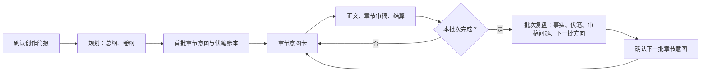

# web-story

一个通用 Agent Skill，用自然语言协助创作原创中文网络小说。

它适用于支持标准 `SKILL.md` 的 Agent：从一个灵感开书、拆解参考作品、规划短中长篇、持续连载、审稿修订、导入旧稿续写，以及整理投稿准备材料。它不是某个编辑器或某个模型专用的插件。

## 安装

```bash
npx skills add wangxiaocuo/web-story
```

`skills` CLI 会识别你本机支持的 Agent 并安装。也可以明确指定目标 Agent 或全局安装，例如：

```bash
# 安装到指定 Agent 的全局 skills 目录
npx skills add wangxiaocuo/web-story -g -a claude-code -y
npx skills add wangxiaocuo/web-story -g -a codex -y
```

查看 CLI 支持的 Agent 和安装选项：

```bash
npx skills add --help
```

## 怎么使用

安装后，直接向你的 Agent 说你要写什么即可：

```text
我想写一本 20 万字的古言重生文，先给我三套开书方案。
帮我规划第一卷 30 章：女主的复仇线要强，感情线慢热。
继续《夜航者》第 12 章，师父线不能改。
审第 18 章，找会影响追读的硬伤并修订。
拆解这部小说的前 20 章，重点分析开篇钩子和升级节奏。
对比拆解这三本同题材作品，再为我的新书生成原创开篇方案。
把这部小说整理成通用中文网文投稿包。
```

如果你的 Agent 支持自定义斜杠命令，可以使用：

```text
/web-story 写一本都市异能升级文，第一章要有强钩子。
```

但斜杠命令是否可用取决于宿主；它不是使用此 Skill 的前提。自然语言请求与宿主提供的 Skill 调用方式同样有效。

**你不需要手动输入 Python 命令、管理 JSON、创建工作区或执行校验。** 这些是 Skill 在有能力时自动使用的内部机制。

## 它如何帮助长篇不写崩

每部书都保存在作者自己的项目目录中：

```text
我的小说/
├── 正文/                         # 已接受章节
├── 大纲/                         # 创作简报、总纲、卷纲、章节意图
├── 设定集/                       # 人物、世界观、文风契约
├── 素材/
│   └── 拆书/                     # 参考作品分析，与正史隔离
├── 投稿包/                       # 稿件与投稿准备材料
└── .web-story/
    ├── canon.json                # 已确认的正史事实
    ├── timeline.json             # 时间线
    ├── hooks.json                # 伏笔和读者承诺
    ├── summaries/                # 章节/分卷摘要
    ├── reviews/                  # 审稿结果
    ├── runs/                     # 可恢复提交日志
    └── staging/                  # 尚未接受的章节工作区
```

写一章时，Skill 会先建立本章意图：冲突、目标、不可改动事实、伏笔和结尾拉力；再写正文、审稿、提取新事实并更新摘要。只有这些内容彼此一致时，章节才会进入 `正文/`。

它不会每章把整部书读进上下文，而是优先读取当前目标、硬设定、相邻章节和相关伏笔。远期正文仅在有明确依赖时才加载。

写作与审稿还会专门检查四类问题：

- **人物感知与认知：** 区分客观事实、旁白、读者知识和各人物已知信息，核对关键台词与反应的信息来源。
- **手机阅读节奏：** 默认短段为主，按动作和意思分段；连续长段需复核，也避免机械地一句一段。
- **自然中文、文风与模板感：** 按完整话轮复读关键对白，检查句法搭配、人物当下的交流目的，以及相邻话轮是否改变信息、立场、关系压力或行动；修订无功能的关键词回声、翻译腔式省略、口号式对称句、万能群体反应、重复解释、同质对白、泛化描写和套路化收尾，并比较相邻章节中的重复习惯。
- **中文标点：** 默认全角标点（，。：；？！“”（）……——）；数字、单位、英文与代码保留半角；提交时脚本会机械拒绝与汉字相邻的半角标点，作者明确接受时可显式放行。
- **生活情境与连续性：** 先检查日常细节是否适合时代、地域、人物和眼下活动，再核对同章转场中的衣着、携带、身体与空间状态；跨章按稳定实体标识与正文来源核对身份、属性和变化历史。首章同样执行，少见习惯不自动判错。

这些是写前约束与写后审稿机制，不能保证零错误或某种 AI 检测结果。脚本负责验证审稿记录、提交条件和中文标点规范，无法理解对白、判断文风或自动识别全部语义冲突。

## 写书流程 / 推荐工作流

适合连载长篇的推荐循环是：**规划开书 → 首批章节意图 → 逐章写作与审稿 → 批次复盘（含审读） → 下一批章节意图**。项目中的真实术语是“首批章节意图”和“章节意图卡”；“批次”是 3–10 章的创作单位，不是一个单独的命令或固定文件。



### 1. 开书：先把书规划到“首批可写”

先确认书名（可暂定）、篇幅模式和创作简报：题材/一句灵感、主角或核心关系、主冲突或读者承诺。随后生成并由你确认：**总纲、卷纲、人物关系、首批章节意图和伏笔账本**。

连载长篇不要求开书时伪造完整百万字细纲；先让首卷和首批章节达到可写程度即可。

### 2. 生成首批章节意图

开书规划确认后，请 Agent 生成首批（通常 3–10 章）章节意图。它应说明每章要解决或升级的问题、必须推进的剧情、不可改变的事实、要埋设或回收的伏笔，以及章末拉力。它们共同承担“批次意图”的作用，但项目中保存和执行的单位是**章节意图**。

### 3. 按章节意图写正文

每章先建立一张**章节意图卡**，再起草正文。意图卡包含 POV、时间地点、章节问题、人物目标与阻力、必须推进、禁止改变、伏笔、结尾拉力和目标字数。正文完成后会先做章节审稿；审稿通过，且新增事实和伏笔记录有效，才结算进 `正文/` 并更新摘要、正史和伏笔账本。

### 4. 一批写完后做批次复盘（含审读）

完成一个批次后，不直接裸写下一章。先汇总本批完成章节、已确认事实、开放或逾期伏笔、未解决审稿问题，并审看本批是否完成了阶段目标、剧情推进和节奏。再给出 2–3 个下一批方向，供你选择或调整。

### 5. 确认下一批方向，继续循环

你确认下一批方向后，生成下一批章节意图，继续逐章写作、审稿和结算。批次的作用是把阶段目标、剧情推进、伏笔回收和节奏校准放在一处控制，避免脱离整体计划地逐章裸写。除非你明确授权，Skill 不会跨过批次边界连续生产正文。

### 新书从 0 到开始写正文：示例

按下面的顺序直接对 Agent 说即可；不需要手动运行项目命令：

1. `我想写一本 80 万字的都市异能升级文：主角靠鉴定能力翻身，第一卷重点是进入地下拍卖场。请先给我三套开书方案。`
2. `选第二套。请确认创作简报，并生成总纲、第一卷卷纲、人物关系、首批 5 章章节意图和伏笔账本。`
3. `确认这套首批计划。按第 1 章章节意图写正文，审稿通过后结算；然后继续第 2 章。`
4. `首批 5 章完成后，做一次批次复盘：检查阶段目标、剧情推进、伏笔、节奏和未解决审稿问题，再给我下一批的方向。`
5. `选方向 A，生成下一批章节意图并从第 6 章开始。`

## 拆书与原创转化

Skill 支持单书拆解、指定章节拆解、多书同范围对比，以及围绕某个创作问题的定向分析。它会区分文本观察、分析推断和创作建议，重点识别读者承诺、开篇触发、章节功能、人物选择、冲突与回报、信息释放、章末拉力和长线故事引擎。

需要保存结果时，拆书报告会放在书籍项目的 `素材/拆书/` 下，与正史、大纲和正文隔离。分析结果不会自动改动你的作品；只有你确认原创方向后，Skill 才会把选择转入创作简报或未来章节计划。

拆书用于学习抽象机制，不用于复刻原作。Skill 不会主动获取未经授权的完整小说，也不会生成换名、换背景式的“换皮版”。将分析用于新书时，它会标出不可照搬的识别性元素，并给出至少两个差异明显的原创方向。

## 三种创作方式

| 方式 | 适合什么 | 节奏 |
|---|---|---|
| 短篇 | 单次完整故事、征文或短篇投稿 | 先确定闭环，再完成正文与终审 |
| 中篇 | 多幕、多卷、数万到十余万字作品 | 每一幕或每 5–10 章复盘 |
| 连载长篇 | 持续更新的商业网文 | 每 3–10 章一个批次，作者决定下一批方向 |

长篇不会在没有作者确认的情况下连续生成几十章。批次结束时会汇总已确认事实、未回收伏笔、审稿风险和下一批选择。

## 审稿与修订

审稿关注故事本身：因果、人物动机、知识边界、节奏、对白、章节承诺、伏笔和读者拉力。中高严重度问题必须给出位置、影响与可执行建议。

改动人物核心动机、结局、世界规则或已接受章节时，Skill 会先说明会连带影响哪些正文、摘要、正史和伏笔，再等待作者确认；它不会悄悄替你重写已经定下的故事。

## 投稿准备

Skill 可以生成标题候选、简介、标签、卖点、样章/目录清单、全稿和投稿前人工复核清单。

它不保证审核通过、签约或收益。平台规则、AI 协作披露与合同条款会变化；在生成具体平台的材料前，Skill 会要求核对该平台当期官方规则。它也不提供规避 AI 检测、伪造人工创作或模仿在世作者独特文风的能力。

## 兼容性与项目状态

- 标准 Agent Skill 结构：根目录 `SKILL.md` 加按需加载的 `references/`、`scripts/`。
- 不依赖某个模型、某个 IDE 或某个 Agent 的私有元数据。
- 有 Python 3 时，Agent 可自动使用内置校验工具完成字数、状态和恢复对账；没有 Python 时仍可用，Agent 会以文件契约完成流程，并明确告知哪些自动校验无法执行。
- 当前版本实现了书籍脚手架、结构化拆书与原创转化、章节暂存与提交、正史/伏笔记录、对账、基础审稿流程和通用投稿包。
- 新提交的审稿记录须包含感知、连续性、手机阅读和文风的检查依据；未修复的 `blocker`、未修复且未经作者接受的 `major` 会阻止提交。已结算记录保留原样，旧的暂存章节只需在下一次提交前补齐审稿记录。实体元数据可按当前章节需要逐步补充，不要求整书迁移。

## 开发

维护者可运行测试：

```bash
python3 -m unittest discover -s tests -v
```

本项目采用 [MIT License](LICENSE)。项目借鉴公开作品的架构思路，但不复制受 GPL/AGPL 保护项目的代码、提示词或模板。
